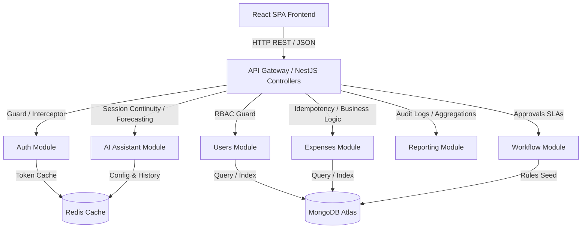

# Project Context: Enterprise Spend Management Suite

This document outlines the system architecture, reference models, and design patterns governing the **Enterprise Spend Management Suite** (Equinox Finance).

---

## 1. System Architecture

The application is built using a modern **Service-Oriented Decoupled Architecture** split into a NestJS REST API Backend and a React SPA Frontend.

---

## 2. Service to Module Mappings

The system maps client services into the following architectural modules:

| Proposed Service | Architectural Module | Purpose |
| :--- | :--- | :--- |
| `auth-service` | **Auth Module** | JWT Access/Refresh tokens, Google OAuth placeholders, multi-factor authentication checks, and RBAC guards. |
| `api-gateway` | **Common / NestJS API Core** | Directing requests, rate limiting, request validation pipes, global exception filtering, and PII masking filters. |
| `core-business-service` | **User & Expense Modules** | Managing profile configurations, cost-centers, expense submissions, receipt OCR uploads, and duplicate check hashing. |
| `workflow-service` | **Workflow Module** | Seeding default approval rules, evaluating limit thresholds, processing approvals queues, and logging SLA actions. |
| `notification-service` | **Notifications Module** | Firebase Cloud Messaging (FCM) providers, in-app notifications feeds, and event-driven email delivery. |
| `reporting-service` | **Reporting Module** | Real-time statistics aggregation, CSV/PDF compiling, and dynamic filter criteria evaluations. |
| `ai-service` | **AI Assistant Module** | Category suggestion, chat continuity, spend forecasting charts, and anomaly detection feeds. |

---

## 3. Database Schema Layouts (MongoDB & Mongoose)

- **User Schema**: Includes profile tags, hashed credentials, roles (`admin`, `manager`, `employee`, `finance`, `auditor`), `costCenter`, `isActive`, and audit metadata.
- **Expense Schema**: Stores submission amounts, converted USD balances, category/cost-center references, receipt hashes, idempotency keys, policy violation logs, and raw OCR data.
- **Workflow Level Schema**: Defines multi-stage rules (Level Index, Limit, Auto-Escalation SLA triggers, and specific department conditions).

---

## 4. Key Design Patterns

1. **Idempotency Safeguard**: Utilizes custom `Idempotency-Key` headers on expense submissions. The server caches keys in Redis/MongoDB to prevent double-charging or double-reimbursement.
2. **Optimistic Locking**: Enforced during simultaneous manager approval actions to prevent race conditions.
3. **PII Masking**: Global exception filters intercept responses to automatically strip and mask personal identifiers (emails, phone numbers) in logs.
4. **CSS-based Font Scaling**: Scales custom components and Tailwind micro-font classes dynamically without polluting the TSX markup.
